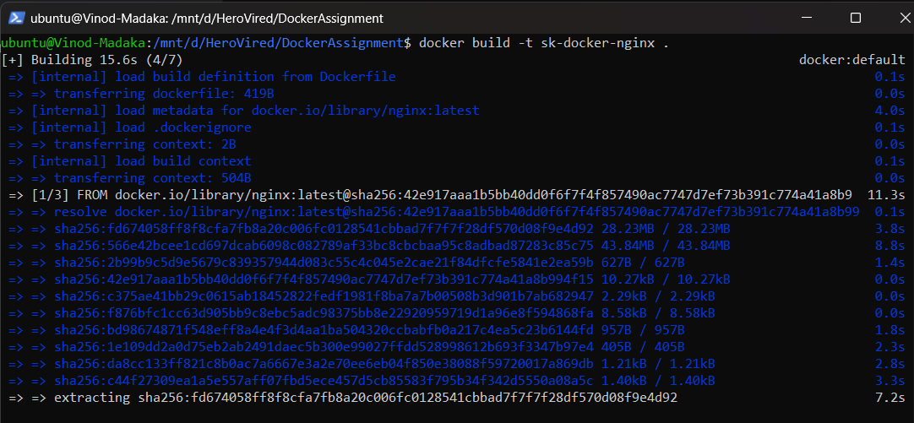
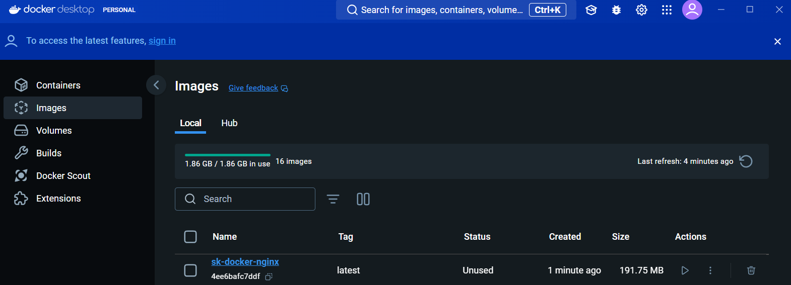
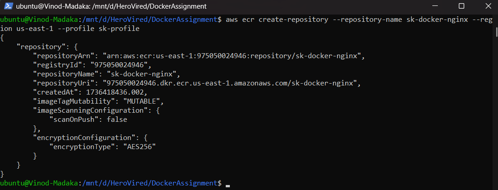
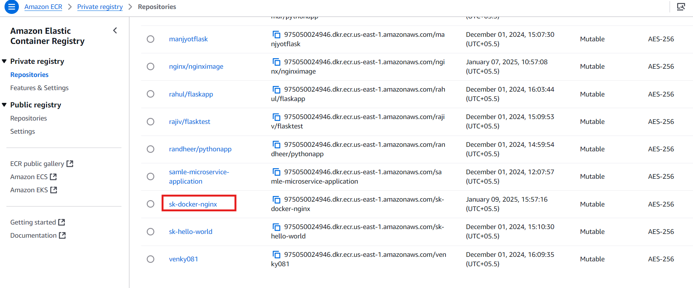
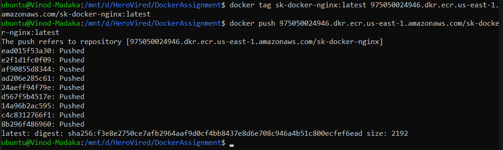
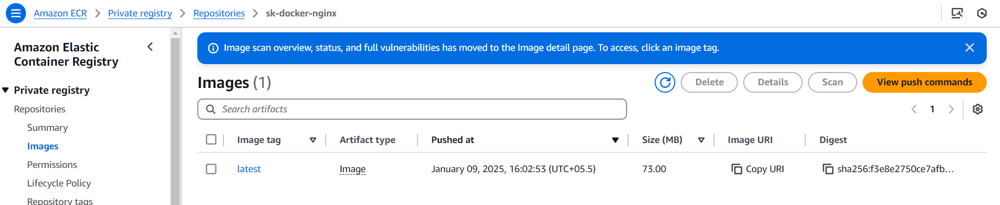

# Dockerizing a Plain HTML Page With Nginx
Repository for Graded Assignment on Dockerizing a Plain HTML Page With Nginx

## Objective
This demonstrates the containerization by Dockerizing a simple HTML page using Nginx as the web server.

---

## Instructions

### 1. Basic HTML page
Create a plain HTML page named `index.html` with some content (e.g., "Hello, Docker!")
   - [Index.html](Files/Index.html)

---

### 2. Nginx Configuration:
Create an Nginx configuration file named `nginx.conf` that serves the `index.html` page & configure Nginx to listen on port 80.
   - [nginx.conf](Files/nginx.conf)
   ```nginx.conf
      server {
         listen 80;
         server_name localhost;

         location / {
            root /usr/share/nginx/html;
            index index.html;
         }
      }
   ```

---

### 3. Dockerfile:
Create a `Dockerfile` The Dockerfile to build an Nginx-based Docker image, serving the `index.html` page
   - [DockerFile](Files/DockerFile)
   ```Dockerfile
      # Use an official Nginx base image
      FROM nginx:latest

      # Copy the `index.html` and `nginx.conf` files into the appropriate location in the container
      COPY index.html /usr/share/nginx/html/index.html
      COPY nginx.conf /etc/nginx/nginx.conf

      # Listen to port 80
      EXPOSE 80

      # Ensure that the Nginx server is started when the container is run
      CMD ["nginx", "-g", "daemon off;"]
   ```

---

### 4. Build the docker image:
 Run the following command in the project directory where the `Dockerfile` is located:
   ```bash
   docker build -t sk-docker-nginx .
   ```
   Execution: 
      
   
   Validation:
      

   Run the container using below command and access at http://localhost
   ```bash
   docker run -p 80:80 sk-docker-nginx
   ```

---

### 5. Push the image on ECR
1. Configure AWS CLI
   - Open Terminal -> 
   ```bash
      aws configure
   ```
   - Input your 'Access key ID' & 'Secret access key'
2. Login to ECR & auhenticate Docker
   ```bash
      aws ecr get-login-password --region <your-region> | docker login --username AWS --password-stdin <aws_account_id>.dkr.ecr.<your-region>.amazonaws.com
   ```
3. Create ECR Repository
   ```bash
      aws ecr create-repository --repository-name sk-docker-nginx --region <your-region> --profile <your-profile>
   ```
   Profile can be setup using following command
   ```bash
      aws configure --profile <profilename>
   ```
      
   Verify the ECR repository creation by logging into AWS ECR
      

4. Tag your image to match your repository in AWS ECR
   ```bash
      docker tag sk-docker-nginx:latest <aws_account_id>.dkr.ecr.<your-region>.amazonaws.com/sk-docker-nginx:latest
   ```
5. Push the Image to the ECR Repository
   ```bash
      docker push <aws_account_id>.dkr.ecr.<your-region>.amazonaws.com/sk-docker-nginx:latest
   ```
      
   Verify the image is pushed to the ECR repository
      
   
---

